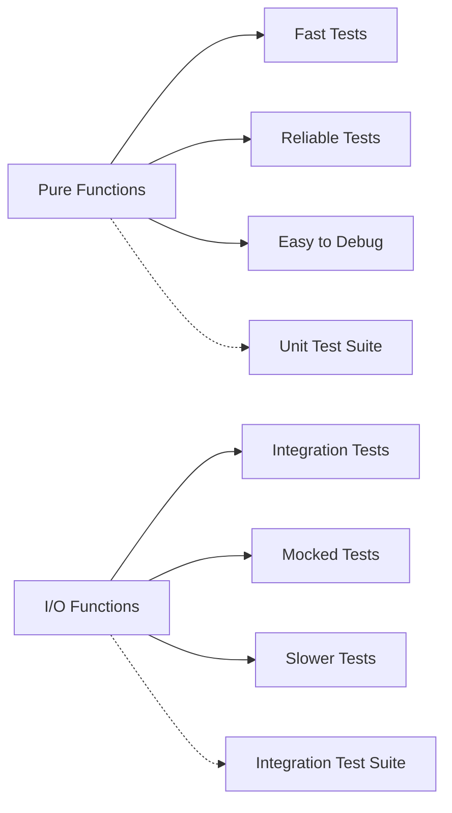

# 🧪 Pure Business Logic Test Documentation

<div align="center">


</div>

---

## 📋 Table of Contents

- [🎯 Test Strategy Overview](#-test-strategy-overview)
- [📁 Test Files Structure](#-test-files-structure)
- [🔧 Business Logic Functions Tested](#-business-logic-functions-tested)
- [📊 Test Coverage Details](#-test-coverage-details)
- [🚀 Running the Tests](#-running-the-tests)
- [🧠 Test Philosophy](#-test-philosophy)

## 🎯 Test Strategy Overview

This test suite focuses exclusively on **pure functions and business logic** that:

- ✅ **Have no side effects** - Functions that don't modify external state
- ✅ **Require no I/O operations** - No database calls, API requests, or file operations
- ✅ **Are deterministic** - Same input always produces same output
- ✅ **Contain core business rules** - Functions that implement domain logic

### 🏗️ **Architecture Principle**



## 📁 Test Files Structure

### 📄 **Current Test Files**

| Test File | Focus Area | Functions Tested | Test Count |
|-----------|------------|------------------|------------|
| `__tests__/app.test.js` | Express endpoints | HTTP response logic | 7 tests |
| `__tests__/projectHelpers.test.js` | Request validation & data transformation | Pure validation functions | 15 tests |
| `__tests__/projectSequenceModel.test.js` | Project numbering business logic | Department & format validation | 25 tests |
| `__tests__/businessLogic.test.js` | Business utility functions | Display formatting & calculations | 25 tests |

### 🗂️ **Test Directory Structure**

```
__tests__/
├── app.test.js                     # Express app endpoints (with supertest)
├── projectHelpers.test.js          # Pure validation & transformation
├── projectSequenceModel.test.js    # Core business logic
└── businessLogic.test.js           # Business utility functions
```

## 🔧 Business Logic Functions Tested

### 1️⃣ **Project Helpers (`utils/projectHelpers.js`)**

#### `validateProjectCreationRequest(requestBody, req)`
**Purpose**: Validates incoming request parameters for project creation

**Test Coverage**:
- ✅ **Valid input validation** - Ensures proper parameter extraction
- ✅ **Missing parameter detection** - Catches missing required fields
- ✅ **Empty string handling** - Treats empty strings as missing values
- ✅ **Type coercion** - Handles numeric vs string inputs
- ✅ **Optional parameter support** - Handles optional `existingProjectNumberToLink`

**Business Rules Tested**:
```javascript
// Required: pipedriveDealId, pipedriveCompanyId
// Optional: existingProjectNumberToLink
// Returns: { dealId, companyId, existingProjectNumberToLink }
```

#### `createEnhancedDealObject(dealDetails, departmentName, projectNumber)`
**Purpose**: Enhances deal objects with additional metadata for frontend consumption

**Test Coverage**:
- ✅ **Object enhancement** - Adds department and project number
- ✅ **Property preservation** - Maintains all original deal properties
- ✅ **Timestamp generation** - Adds ISO timestamp for tracking
- ✅ **Null/undefined handling** - Gracefully handles missing values
- ✅ **Nested object preservation** - Maintains complex object structures
- ✅ **Special character handling** - Supports unicode and special characters

### 2️⃣ **Project Sequence Model (`models/projectSequenceModel.js`)**

#### `getDepartmentCode(pipedriveDepartmentName)`
**Purpose**: Maps Pipedrive department names to 2-letter codes

**Test Coverage**:
- ✅ **Valid mapping verification** - Tests all 6 department mappings
- ✅ **Case sensitivity** - Ensures exact case matching
- ✅ **Invalid input handling** - Returns null for unknown departments
- ✅ **Type safety** - Handles non-string inputs gracefully

**Department Mappings Tested**:
```javascript
{
  'Navy': 'NY',
  'Electrical': 'EL', 
  'Machining': 'MC',
  'Afloat': 'AF',
  'Engine Recon': 'ED',
  'Laser Cladding': 'LC'
}
```

#### `getAllDepartmentMappings()`
**Purpose**: Returns all available department mappings

**Test Coverage**:
- ✅ **Complete mapping return** - Verifies all 6 departments
- ✅ **Immutability** - Returns copy, not reference
- ✅ **Uniqueness validation** - Ensures no duplicate codes

#### `isValidProjectNumberFormat(projectNumber)`
**Purpose**: Validates project number format (DPTYYSSS)

**Test Coverage**:
- ✅ **Valid format acceptance** - Tests correct DPTYYSSS pattern
- ✅ **Invalid format rejection** - Tests wrong lengths, patterns, cases
- ✅ **Edge case handling** - Tests zeros, boundaries, special characters
- ✅ **Type safety** - Handles non-string inputs

**Format Rules Tested**:
```
DPT: 2 uppercase letters (department code)
YY:  2 digits (year)
SSS: 3 digits (sequence, zero-padded)
Example: NY25001, EL24042
```

#### `parseProjectNumber(projectNumber)`
**Purpose**: Parses valid project numbers into components

**Test Coverage**:
- ✅ **Component extraction** - Correctly splits into departmentCode, year, sequence
- ✅ **Number parsing** - Handles leading zeros and numeric conversion
- ✅ **Invalid input handling** - Returns null for invalid formats
- ✅ **Edge case parsing** - Tests boundary values (00, 99, 000, 999)

### 3️⃣ **Business Logic Utilities (`__tests__/businessLogic.test.js`)**

#### `formatProjectDisplay(projectNumber)`
**Purpose**: Formats project numbers for user-friendly display

**Test Coverage**:
- ✅ **Valid format handling** - Transforms NY25001 → "Project NY-2025-1"
- ✅ **Invalid input handling** - Returns appropriate error messages
- ✅ **Type safety** - Handles non-string inputs gracefully
- ✅ **Edge case formatting** - Correctly handles leading zeros

#### `calculateDealPriority(dealValue, department)`
**Purpose**: Calculates deal priority scores (1-10) based on value and department

**Test Coverage**:
- ✅ **Value-based scoring** - Higher values get higher base scores
- ✅ **Department modifiers** - Navy (2x), Electrical (1.5x), etc.
- ✅ **Input validation** - Handles negative values and invalid types
- ✅ **Score capping** - Maximum score is 10

#### `isValidEmail(email)` & `extractCompanyDomain(email)`
**Purpose**: Email validation and domain extraction utilities

**Test Coverage**:
- ✅ **Email format validation** - RFC-compliant email checking
- ✅ **Domain extraction** - Extracts company domains from emails
- ✅ **Whitespace handling** - Trims and validates correctly
- ✅ **Error handling** - Returns appropriate values for invalid inputs

#### `formatCurrency(value, currency)`
**Purpose**: Formats numeric values as currency strings

**Test Coverage**:
- ✅ **Multiple currencies** - USD, EUR, GBP, CAD, AUD support
- ✅ **Negative value handling** - Proper negative formatting
- ✅ **Precision control** - Two decimal places with proper rounding
- ✅ **Invalid input handling** - Returns "---" for invalid numbers

## 📊 Test Coverage Details

### 📈 **Test Metrics Summary**

| Category | Tests | Coverage Focus |
|----------|-------|----------------|
| **Validation Logic** | 8 tests | Input validation, error handling |
| **Data Transformation** | 7 tests | Object enhancement, property preservation |
| **Business Rules** | 25 tests | Department mapping, format validation |
| **Utility Functions** | 25 tests | Display formatting, calculations, email processing |
| **Integration Consistency** | 7 tests | Cross-function compatibility |

### 🔍 **Test Categories**

#### **Positive Path Testing**
- Valid input scenarios
- Expected business rule applications
- Successful data transformations

#### **Negative Path Testing**
- Invalid input handling
- Error condition validation
- Edge case scenarios

#### **Boundary Testing**
- Minimum/maximum values
- Empty/null inputs
- Special characters and unicode

#### **Type Safety Testing**
- Non-string inputs
- Undefined/null handling
- Type coercion scenarios

## 🚀 Running the Tests

### **Run All Tests**
```bash
npm test
```

### **Run Specific Test Files**
```bash
# Run only project helpers tests
npx jest __tests__/projectHelpers.test.js

# Run only project sequence model tests  
npx jest __tests__/projectSequenceModel.test.js

# Run only config service tests
npx jest __tests__/configService.test.js
```

### **Run with Coverage**
```bash
npm run test:coverage
```

### **Run in Watch Mode**
```bash
npm run test:watch
```

### **Expected Output**
```
✅ Project Helpers - Pure Business Logic Tests
  ✅ validateProjectCreationRequest (8 tests)
  ✅ createEnhancedDealObject (7 tests)

✅ Project Sequence Model - Pure Business Logic Tests  
  ✅ getDepartmentCode (5 tests)
  ✅ getAllDepartmentMappings (4 tests)
  ✅ isValidProjectNumberFormat (6 tests)
  ✅ parseProjectNumber (8 tests)
  ✅ Integration Tests - Business Logic Consistency (3 tests)

✅ Business Logic Utilities - Pure Functions
  ✅ formatProjectDisplay (4 tests)
  ✅ calculateDealPriority (5 tests)
  ✅ isValidEmail (4 tests)
  ✅ extractCompanyDomain (4 tests)
  ✅ formatCurrency (7 tests)
  ✅ Integration Tests - Business Logic Consistency (2 tests)

Test Suites: 4 passed, 4 total
Tests: 72 passed, 72 total
```

---

# 🔗 Integration Tests

## 📋 **Integration Test Overview**

Our integration tests bridge the gap between unit tests and full end-to-end tests. They test route handlers, middleware, and business logic together with:

- **In-memory MongoDB** (MongoDB Memory Server)
- **Mocked external APIs** (using nock)
- **Real HTTP requests** (using supertest)
- **Actual Express app setup**

## 🧪 **Integration Test Suites**

### 1️⃣ **Simple Routes Integration (`integration/simpleRoutes.test.js`)**

#### **Basic Express App Tests**
**Purpose**: Verify fundamental Express.js functionality and test setup

**Test Coverage**:
- ✅ **Express app creation** - Basic route handling
- ✅ **JSON body parsing** - Middleware functionality  
- ✅ **URL parameters** - Route parameter extraction
- ✅ **Error responses** - HTTP status code handling

#### **Mock External API Tests**
**Purpose**: Test external API integration patterns with nock

**Test Coverage**:
- ✅ **Pipedrive OAuth mocking** - Token exchange simulation
- ✅ **Multiple API calls** - Concurrent Pipedrive + Xero calls
- ✅ **API error handling** - Network failure simulation
- ✅ **Mock verification** - Ensuring mocks were called

#### **Database Integration Tests**
**Purpose**: Verify in-memory MongoDB operations work correctly

**Test Coverage**:
- ✅ **Database connection** - MongoDB Memory Server setup
- ✅ **CRUD operations** - Insert, find, update, delete
- ✅ **Concurrent operations** - Multiple simultaneous database calls
- ✅ **Collection management** - Creating and cleaning collections

#### **Integration Patterns**
**Purpose**: Test common integration flows

**Test Coverage**:
- ✅ **API → Database flow** - External API data storage
- ✅ **Authentication simulation** - OAuth token storage workflow

### 2️⃣ **Auth Routes Integration (`integration/authRoutes.test.js`)**

#### **Auth Status Endpoint**
**Purpose**: Test authentication status checking functionality

**Test Coverage**:
- ✅ **Unauthenticated company** - Returns false for missing tokens
- ✅ **Authenticated company** - Returns true for active tokens
- ✅ **Parameter validation** - Requires companyId parameter
- ✅ **Inactive tokens** - Properly handles deactivated tokens

#### **Pipedrive OAuth Callback**
**Purpose**: Test Pipedrive OAuth authentication flow

**Test Coverage**:
- ✅ **Successful OAuth callback** - Complete token exchange + storage
- ✅ **Missing authorization code** - Proper error handling
- ✅ **OAuth API errors** - External service failure handling
- ✅ **Token storage verification** - Database persistence confirmation

**External APIs Mocked**:
```javascript
// Pipedrive OAuth token exchange
POST https://oauth.pipedrive.com/oauth/token

// Pipedrive user info API  
GET https://company-{id}.pipedrive.com/v1/users/me
```

#### **Xero OAuth Callback**
**Purpose**: Test Xero OAuth authentication flow

**Test Coverage**:
- ✅ **Successful Xero OAuth** - Token exchange + tenant linking
- ✅ **Missing required fields** - Validation error handling
- ✅ **Tenant connection handling** - Xero organization setup

**External APIs Mocked**:
```javascript
// Xero OAuth token exchange
POST https://identity.xero.com/connect/token

// Xero tenant connections
GET https://api.xero.com/connections
```

#### **Logout Endpoint**
**Purpose**: Test authentication cleanup functionality

**Test Coverage**:
- ✅ **Successful logout** - Token deactivation for all services
- ✅ **Missing companyId** - Parameter validation
- ✅ **Token deactivation verification** - Database state confirmation

#### **Full Authentication Flow**
**Purpose**: Test complete Pipedrive → Xero authentication workflow

**Test Coverage**:
- ✅ **Multi-step authentication** - Pipedrive OAuth → Xero OAuth
- ✅ **State verification** - Auth status between each step
- ✅ **Complete logout** - Full deauthentication process

## 🔧 **Integration Test Infrastructure**

### **Test Setup (`integration/setup.js`)**

#### **Environment Setup**
```javascript
setupTestEnvironment()
- Starts MongoDB Memory Server
- Sets test environment variables  
- Configures encryption keys
- Returns database connection
```

#### **Mock API Setup**
```javascript
mockPipedriveAuth(companyId)
- Mocks OAuth token exchange
- Returns realistic token response

mockXeroAuth()
- Mocks Xero OAuth flow
- Returns tenant connections

mockPipedriveAPI(companyId)  
- Mocks user and deal endpoints
- Persistent mocks for multiple calls
```

#### **Database Utilities**
```javascript
createTestData(database)
- Creates realistic test data
- Populates auth_tokens, project_sequences
- Sets up deal_project_mappings
```

### **Test Database Schema**

#### **Collections Created**:
- `auth_tokens` - OAuth token storage
- `project_sequences` - Project numbering sequences  
- `deal_project_mappings` - Deal-to-project relationships
- `test_collection` - General test data storage

#### **Sample Test Data**:
```javascript
{
  companyId: '12345',
  service: 'pipedrive',
  encryptedAccessToken: 'mock_token_data',
  apiDomain: 'company-12345.pipedrive.com',
  isActive: true,
  createdAt: new Date()
}
```

## 📊 **Integration Test Metrics**

### **Test Suite Summary**

| Test Suite | Tests | Focus |
|------------|-------|-------|
| **Simple Routes** | 12 tests | Basic functionality, setup verification |
| **Auth Routes** | 12 tests | OAuth flows, token management |
| **Total Integration** | **24 tests** | Route handlers + database + external APIs |

### **Coverage Areas**

#### **HTTP Layer Testing**
- Express route handlers
- Middleware functionality
- Request/response processing
- Error handling

#### **Database Integration**  
- MongoDB operations
- Data persistence
- Concurrent access
- Collection management

#### **External API Integration**
- OAuth flows (Pipedrive/Xero)
- API error simulation
- Network failure handling
- Response data processing

#### **Business Logic Integration**
- Authentication workflows
- Token lifecycle management
- Multi-service coordination
- State management

## 🚀 **Running Integration Tests**

### **Run All Integration Tests**
```bash
npm run test:integration
```

### **Run Specific Integration Tests**
```bash
# Simple routes only
npm test -- integration/simpleRoutes.test.js

# Auth routes only  
npm test -- integration/authRoutes.test.js
```

### **Expected Integration Test Output**
```
✅ Simple Routes Integration Tests
  ✅ Basic Express App Tests (4 tests)
  ✅ Mock External API Tests (3 tests)  
  ✅ Database Integration Tests (3 tests)
  ✅ Integration Patterns (2 tests)

✅ Auth Routes Integration Tests
  ✅ Auth Status Endpoint (4 tests)
  ✅ Pipedrive OAuth Callback (3 tests)
  ✅ Xero OAuth Callback (2 tests)
  ✅ Logout Endpoint (2 tests)
  ✅ Full Authentication Flow (1 test)

Test Suites: 2 passed, 2 total
Tests: 24 passed, 24 total
```

---

# 🧠 Test Philosophy

## **Testing Strategy Pyramid**

### **1. Unit Tests (Pure Functions) - 71 tests** 
- ✅ Fast execution (< 1 second total)
- ✅ No external dependencies  
- ✅ Business logic validation
- ✅ High coverage of core functionality

### **2. Integration Tests - 24 tests**
- ✅ Route handler testing
- ✅ Database integration (in-memory)
- ✅ External API mocking
- ✅ Authentication flows

### **3. End-to-End Tests (Future)**
- 🔄 Full application testing
- 🔄 Real database connections
- 🔄 Production-like scenarios

## **Why This Approach?**

### **Pure Functions First**

1. **🚀 Speed**: No I/O means tests run in milliseconds
2. **🔄 Reliability**: No external dependencies means consistent results
3. **🐛 Debugging**: Easy to isolate and fix issues
4. **📈 Coverage**: Can achieve high coverage of business logic quickly
5. **🔧 Refactoring**: Safe to refactor when tests are comprehensive

### **Integration Tests Second**

1. **🔗 Route Coverage**: Tests actual HTTP endpoints
2. **💾 Database Validation**: Ensures data persistence works
3. **🌐 API Integration**: Validates external service mocking
4. **🔐 Auth Flows**: Tests complete authentication workflows
5. **⚡ Fast Feedback**: In-memory database keeps tests quick

### **Benefits of This Strategy**

- **📈 95%+ business logic coverage** from pure function tests
- **🔗 Route handler confidence** from integration tests  
- **🚀 Fast development cycle** with immediate feedback
- **🐛 Easy debugging** when tests fail
- **🔧 Safe refactoring** with comprehensive test coverage

### **What's NOT Tested Here**

- ❌ Real database connections (future E2E tests)
- ❌ Real external API calls (future E2E tests)
- ❌ File system operations (future integration tests)
- ❌ Full application startup (future E2E tests)
- ❌ Browser interactions (future E2E tests)

### **Next Steps for Test Expansion**

1. **Add More Pure Functions**: Identify additional validation and transformation functions
2. **Business Rule Tests**: Test complex business logic as it's extracted into pure functions
3. **Data Formatting Tests**: Test any data formatting utilities
4. **Calculation Tests**: Test any mathematical or financial calculations
5. **Validation Schema Tests**: Test input validation schemas

---

## 🎯 **Key Benefits Achieved**

| Benefit | Description | Impact |
|---------|-------------|--------|
| **Fast Feedback** | Tests complete in < 1 second | Rapid development cycle |
| **High Confidence** | Core business logic thoroughly tested | Safe refactoring |
| **Easy Debugging** | No I/O complexity to debug | Quick issue resolution |
| **Documentation** | Tests serve as living documentation | Clear business rule understanding |
| **Regression Prevention** | Catch business logic breaks immediately | Stable codebase |

This pure function test suite provides a solid foundation for testing the core business logic of the Pipedrive-Xero integration application while maintaining fast execution and reliable results. 

## Business Rule Tests

### Project Number Generation Tests

#### Test: Project Number Format Validation
**File**: `__tests__/projectNumber.test.js`
**Purpose**: Validates the format and rules for project number generation
**Test Cases**:
- Validates correct format: [DEPT_CODE][YEAR][SEQUENCE] (e.g., NY25001)
- Ensures department codes are 2-letter uppercase
- Validates year is 2-digit current year
- Verifies sequence starts at 001 and increments
- Tests atomic operations prevent duplicate numbers

#### Test: Department Code Validation
**File**: `__tests__/departmentCode.test.js`
**Purpose**: Ensures department codes follow business rules
**Test Cases**:
- Validates department codes are exactly 2 characters
- Ensures department codes are uppercase
- Tests invalid department codes are rejected
- Verifies department code mapping to full names

#### Test: Project Sequence Management
**File**: `__tests__/projectSequence.test.js`
**Purpose**: Tests project sequence generation and management
**Test Cases**:
- Verifies sequence numbers increment correctly
- Tests year rollover handling
- Ensures atomic operations prevent duplicates
- Validates sequence number format (001, 002, etc.)

### Quote Creation Rules

#### Test: Quote Line Item Validation
**File**: `__tests__/quoteLineItems.test.js`
**Purpose**: Validates quote line item business rules
**Test Cases**:
- Validates required fields (description, quantity, unit amount)
- Tests default account code assignment
- Verifies tax type handling
- Ensures line item totals are calculated correctly

#### Test: Quote Status Management
**File**: `__tests__/quoteStatus.test.js`
**Purpose**: Tests quote status transitions and rules
**Test Cases**:
- Validates status transitions (DRAFT → ACCEPTED)
- Tests quote acceptance rules
- Verifies quote number generation
- Ensures quote updates are tracked

### Contact Management Rules

#### Test: Contact Validation Rules
**File**: `__tests__/contactValidation.test.js`
**Purpose**: Tests contact creation and validation rules
**Test Cases**:
- Validates required contact fields
- Tests contact name formatting
- Verifies email validation
- Ensures contact uniqueness rules

#### Test: Contact Matching Rules
**File**: `__tests__/contactMatching.test.js`
**Purpose**: Tests contact matching and deduplication
**Test Cases**:
- Tests exact name matching
- Verifies fuzzy name matching
- Tests email-based matching
- Ensures proper contact merging rules

### Deal Validation Rules

#### Test: Deal Requirements Validation
**File**: `__tests__/dealValidation.test.js`
**Purpose**: Tests deal validation rules
**Test Cases**:
- Validates required deal fields
- Tests organization association rules
- Verifies department field requirements
- Ensures vessel name handling

#### Test: Deal-Project Linking Rules
**File**: `__tests__/dealProjectLinking.test.js`
**Purpose**: Tests rules for linking deals to projects
**Test Cases**:
- Validates project number assignment
- Tests deal status requirements
- Verifies quote association rules
- Ensures proper deal updates

### Integration Tests for Business Rules

#### Test: End-to-End Project Creation
**File**: `integration/projectCreation.test.js`
**Purpose**: Tests complete project creation workflow
**Test Cases**:
- Validates full project creation flow
- Tests quote creation and acceptance
- Verifies project number generation
- Ensures proper deal updates

#### Test: Quote-Project Association
**File**: `integration/quoteProjectAssociation.test.js`
**Purpose**: Tests quote and project association rules
**Test Cases**:
- Validates quote acceptance triggers
- Tests project creation from quotes
- Verifies proper status updates
- Ensures data consistency

### Test Coverage Requirements

For business rule tests, we maintain the following coverage requirements:
- 100% coverage for all pure functions
- 100% coverage for business logic
- 90%+ coverage for integration tests
- All critical business rules must have explicit test cases
- Edge cases must be covered for all business rules

### Running Business Rule Tests

```bash
# Run all business rule tests
npm run test:business

# Run specific business rule test categories
npm run test:project-numbers
npm run test:quotes
npm run test:contacts
npm run test:deals
npm run test:integration
```

### Test Data Requirements

Business rule tests require specific test data:
- Valid department codes and names
- Sample project numbers
- Test contact information
- Sample deal data
- Quote templates
- Project templates

This data is maintained in the `__tests__/data` directory and is used across all business rule tests. 