# 🔧 Pipedrive-Xero Integration Application Workflow

<div align="center">


</div>

---

## 📋 Table of Contents

- [🎯 Application Overview](#-application-overview)
- [🏗️ Architecture Overview](#️-architecture-overview)
- [🔐 OAuth 2.0 Authentication Flows](#-oauth-20-authentication-flows)
- [⚡ Main Features Workflow](#-main-features-workflow)
- [🏢 Backend Structure](#-backend-structure)
- [🗄️ Database Schema](#️-database-schema)
- [🌐 API Interactions](#-api-interactions)
- [⚠️ Error Handling & Validation](#️-error-handling--validation)
- [🧪 Testing Strategy](#-testing-strategy)
- [📚 API Routes Reference](#-api-routes-reference)
- [🔧 Environment Configuration](#-environment-configuration)

## 🎯 Application Overview

> **A sophisticated private Node.js application that seamlessly bridges Pipedrive CRM with Xero accounting software**

```mermaid
graph LR
    A[👤 User] --> B[🔗 Pipedrive Deal]
    B --> C[⚡ Integration App]
    C --> D[📊 Xero Quote]
    C --> E[📋 Xero Project]
    D --> F[✅ Automated Workflow]
    E --> F
```

<div align="center">



</div>

### 🎯 **Core Capabilities**

| Feature | Description | Status |
|---------|-------------|--------|
| 💰 **Quote Creation** | Transform Pipedrive deals into Xero quotes with automated contact management | ✅ Production Ready |
| 📋 **Project Management** | Generate unique project numbers with full Xero project lifecycle | ✅ Production Ready |
| 🔐 **OAuth Authentication** | Secure token management for both Pipedrive and Xero platforms | ✅ Production Ready |

### 🔄 **Integration Flow**

```
Pipedrive Deal → Authentication → Data Processing → Xero Integration → Automated Updates
```

All features originate from Pipedrive deal links and interact with both platforms through authenticated API calls with comprehensive error handling and audit trails.

## 🏗️ Architecture Overview

```mermaid
graph TB
    subgraph "🌐 External Services"
        PD[📈 Pipedrive CRM]
        XR[📊 Xero Accounting]
    end
    
    subgraph "🔧 Application Layer"
        RT[🛣️ Routes]
        MW[⚙️ Middleware]
        CT[🎮 Controllers]
        SV[🔧 Services]
        MD[🗃️ Models]
    end
    
    subgraph "💾 Data Layer"
        MG[(🍃 MongoDB)]
        TK[🔐 Token Storage]
        PS[📋 Project Sequences]
    end
    
    PD <--> RT
    XR <--> RT
    RT --> MW
    MW --> CT
    CT --> SV
    SV --> MD
    MD --> MG
    MG --> TK
    MG --> PS
```

<div align="center">



</div>

### 💻 **Technology Stack**

<table>
<tr>
<td>

**🚀 Runtime & Framework**
-  ES Modules
-  RESTful API
-  ES2022+

</td>
<td>

**🔒 Security & Auth**
-  Multi-platform
-  Token Encryption
-  Secure Transport

</td>
</tr>
<tr>
<td>

**💾 Data & Storage**
-  Document Database
-  Validation
- 🔐 Encrypted Token Storage

</td>
<td>

**🧪 Testing & DevOps**
-  Test Framework
-  Structured Logging
- 🧠 Memory Server Testing

</td>
</tr>
</table>

### 📦 **Key Dependencies**

<details>
<summary><strong>🔍 View Dependencies Details</strong></summary>

```json
{
  "🌐 HTTP & API": {
    "express": "^4.19.2",
    "axios": "^1.7.2",
    "cors": "^2.8.5"
  },
  "💾 Database": {
    "mongodb": "^6.16.0"
  },
  "🔐 Security": {
    "crypto": "^1.0.1",
    "uuid": "^11.1.0"
  },
  "📊 Logging": {
    "pino": "^9.7.0",
    "pino-http": "^10.4.0",
    "pino-pretty": "^13.0.0"
  },
  "🧪 Testing": {
    "jest": "^29.7.0",
    "@shelf/jest-mongodb": "^5.2.2",
    "supertest": "^7.1.1"
  }
}
```

</details>

## 🔐 OAuth 2.0 Authentication Flows

```mermaid
sequenceDiagram
    participant U as 👤 User
    participant F as 🖥️ Frontend
    participant A as 🔧 App Server
    participant P as 📈 Pipedrive
    participant X as 📊 Xero
    participant D as 💾 Database

    Note over U,D: 🔐 Pipedrive OAuth Flow
    U->>F: Click "Connect Pipedrive"
    F->>A: GET /auth/
    A->>A: Generate CSRF Token
    A->>P: Redirect to OAuth
    P->>U: Login & Authorize
    P->>A: Callback with code
    A->>P: Exchange code for tokens
    A->>D: Store encrypted tokens
    A->>F: Redirect to success

    Note over U,D: 🔐 Xero OAuth Flow  
    U->>F: Click "Connect Xero"
    F->>A: GET /auth/connect-xero
    A->>A: Generate CSRF + Link Company
    A->>X: Redirect to OAuth
    X->>U: Login & Authorize
    X->>A: Callback with code
    A->>X: Exchange code for tokens
    A->>D: Store encrypted tokens
    A->>F: Redirect to success
```

<div align="center">



</div>

### 📈 **Pipedrive OAuth Flow**

<details>
<summary><strong>🔍 Click to expand Pipedrive OAuth implementation details</strong></summary>

#### 🚀 **1. Authentication Initiation**

| Property | Value |
|----------|-------|
| 🛣️ **Route** | `GET /auth/` |
| 🎮 **Controller** | `authController.initiatePipedriveAuth()` |
| 🔒 **Security** | CSRF Token Protection |
| 📋 **Scopes** | `deals:full`, `users:read` |

```javascript
// 🔐 Generate CSRF token and redirect to Pipedrive
const csrfToken = crypto.randomBytes(18).toString('hex');
const authorizationUrl = `https://oauth.pipedrive.com/oauth/authorize?client_id=${pipedriveClientId}&redirect_uri=${redirectUri}&state=${csrfToken}&scope=deals:full users:read`;
```

#### 🔄 **2. OAuth Callback Handling**

| Property | Value |
|----------|-------|
| 🛣️ **Route** | `GET /auth/callback` |
| 🎮 **Controller** | `authController.handlePipedriveCallback()` |
| 🔒 **Validation** | CSRF Token + Authorization Code |
| 💾 **Storage** | AES-256-CBC Encrypted Tokens |

**🔄 Process Flow**:

```mermaid
graph LR
    A[📨 Callback] --> B[🔍 Validate CSRF]
    B --> C[🔄 Exchange Code]
    C --> D[👤 Get User Info]
    D --> E[🔐 Encrypt & Store]
    E --> F[↩️ Redirect Success]
```


**💾 Token Storage**:
```javascript
// 🔐 Store encrypted tokens with expiration buffer
await tokenService.storeAuthToken(companyId, 'pipedrive', {
  accessToken: access_token,
  refreshToken: refresh_token,
  apiDomain: api_domain,
  tokenExpiresAt: Date.now() + (expires_in * 1000) - (5 * 60 * 1000) // 5min buffer
});
```

</details>

### Xero OAuth Flow

#### 1. Authentication Initiation
**Route**: `GET /auth/connect-xero`
**Controller**: `authController.initiateXeroAuth()`

**Required Parameter**: `pipedriveCompanyId` (links Xero auth to Pipedrive company)

```javascript
// Map CSRF token to Pipedrive company
const csrfToken = crypto.randomBytes(18).toString('hex');
xeroCsrfStore[csrfToken] = pipedriveCompanyId;

const authorizationUrl = `https://login.xero.com/identity/connect/authorize?response_type=code&client_id=${xeroClientId}&scope=openid profile email accounting.contacts accounting.transactions projects offline_access`;
```

#### 2. OAuth Callback Handling
**Route**: `GET /auth/xero-callback`
**Controller**: `authController.handleXeroCallback()`

**Process Flow**:
1. Validate CSRF token and retrieve associated Pipedrive company
2. Exchange authorization code for Xero tokens
3. Retrieve tenant connections via Xero API
4. Store encrypted tokens linked to Pipedrive company
5. Redirect to frontend with success confirmation

### Token Management

#### Encryption Service
**File**: `services/secureTokenService.js`

**Features**:
- AES-256-CBC encryption for sensitive data
- Database-backed storage with atomic operations
- Automatic token refresh with 5-minute expiry buffer
- In-memory caching with 5-minute TTL
- Audit trails and usage tracking

#### Authentication Middleware
**File**: `middleware/authMiddleware.js`

**Key Functions**:
- `requirePipedriveAuth()`: Validates and refreshes Pipedrive tokens
- `optionalXeroAuth()`: Checks Xero authentication without failing request
- `requirePipedriveWithOptionalXero()`: Combined middleware for most routes

**Token Refresh Logic**:
```javascript
if (Date.now() >= tokenData.tokenExpiresAt) {
  const refreshedToken = await tokenService.refreshPipedriveToken(companyId);
  req.pipedriveAuth = {
    accessToken: refreshedToken.accessToken,
    apiDomain: refreshedToken.apiDomain,
    companyId: companyId
  };
}
```

## ⚡ Main Features Workflow

```mermaid
graph TB
    subgraph "💰 Quote Creation Flow"
        A[🎯 Pipedrive Deal] --> B[🔐 Auth Check]
        B --> C[📊 Fetch Deal Data]
        C --> D[🏢 Contact Management]
        D --> E[📋 Line Items]
        E --> F[📄 Create Quote]
        F --> G[🔄 Update Deal]
    end
    
    subgraph "📋 Project Creation Flow"
        H[🎯 Pipedrive Deal] --> I[🔐 Auth Check]
        I --> J[📊 Fetch Deal Data]
        J --> K[🔢 Generate Number]
        K --> L[🏗️ Create Project]
        L --> M[⚙️ Add Tasks]
        M --> N[✅ Accept Quote]
        N --> O[🔄 Update Deal]
    end
```

<div align="center">



</div>

### 💰 **Create Quote Feature**

#### 🎯 **Entry Point**

| Property | Value |
|----------|-------|
| 🛣️ **Route** | `POST /api/xero/create-quote` |
| 🎮 **Controller** | `xeroController.createXeroQuote()` |
| 🔒 **Middleware** | `requirePipedriveWithOptionalXero` |
| 📊 **Purpose** | Transform Pipedrive deals into Xero quotes |

#### 🔄 **Workflow Steps**

<details>
<summary><strong>🔍 Step 1: Authentication Validation</strong></summary>
```javascript
// 🔐 Middleware provides authenticated tokens
const pdApiDomain = req.pipedriveAuth.apiDomain;
const pdAccessToken = req.pipedriveAuth.accessToken;
const xeroAccessToken = req.xeroAuth.accessToken;
const xeroTenantId = req.xeroAuth.tenantId;
```

</details>

<details>
<summary><strong>🔍 Step 2: Deal Data Retrieval</strong></summary>
   ```javascript
   // Fetch deal details from Pipedrive
   const dealDetails = await pipedriveApiService.getDealDetails(pdApiDomain, pdAccessToken, pipedriveDealId);
   
   // Validate organization association
   if (!dealDetails.org_id || !dealDetails.org_id.value) {
     throw new Error('Deal must be associated with an Organization');
   }
   ```

3. **Contact Management**
   ```javascript
   // Find or create Xero contact
   let existingXeroContact = await xeroApiService.findXeroContactByName(xeroAccessToken, xeroTenantId, contactName);
   
   if (!existingXeroContact) {
     const newContactPayload = {
       Name: contactName,
       ...(contactEmail && { EmailAddress: contactEmail })
     };
     const createdContact = await xeroApiService.createXeroContact(xeroAccessToken, xeroTenantId, newContactPayload);
     xeroContactID = createdContact.ContactID;
   }
   ```

4. **Product Line Items Processing**
   ```javascript
   // Fetch deal products and build line items
   const dealProducts = await pipedriveApiService.getDealProducts(pdApiDomain, pdAccessToken, pipedriveDealId);
   
   let lineItems = dealProducts.map(p => ({
     Description: p.name || 'N/A',
     Quantity: p.quantity || 1,
     UnitAmount: p.item_price || 0,
     AccountCode: process.env.XERO_DEFAULT_ACCOUNT_CODE || "200",
     TaxType: process.env.XERO_DEFAULT_TAX_TYPE || "NONE"
   }));
   ```

5. **Quote Creation**
   ```javascript
   // Create quote with idempotency
   const quotePayload = {
     Contact: { ContactID: xeroContactID },
     Date: currentDate,
     LineItems: lineItems,
     Status: "DRAFT"
   };
   
   const idempotencyKey = uuidv4();
   const createdQuote = await xeroApiService.createQuote(xeroAccessToken, xeroTenantId, quotePayload, idempotencyKey, `Pipedrive Deal ID: ${pipedriveDealId}`);
   ```

6. **Pipedrive Update**
   ```javascript
   // Update deal with quote number
   await pipedriveApiService.updateDealWithQuoteNumber(pdApiDomain, pdAccessToken, pipedriveDealId, createdQuote.QuoteNumber);
   ```

### 2. Update Quotation Feature

#### Entry Point
**Route**: `POST /api/pipedrive/get-quotation-data`
**Controller**: `pipedriveController.getQuotationData()`
**Middleware**: `requireBothPipedriveAndXero`

#### Workflow Steps

1. **Request Validation**
   ```javascript
   // Validate required parameters
   const { dealId, companyId } = req.body;
   if (!dealId || !companyId) {
     throw new Error('Deal ID and Company ID are required');
   }
   ```

2. **Deal Data Retrieval & Quotation Extraction**
   ```javascript
   // Fetch deal details and extract quotation number
   const dealDetails = await pipedriveApiService.getDealDetails(apiDomain, accessToken, dealId);
   const xeroQuoteNumber = xeroQuoteCustomFieldKey ? (dealDetails[xeroQuoteCustomFieldKey] || null) : null;
   ```

3. **Related Data Fetching**
   ```javascript
   // Fetch person, organization, and product details
   const personDetails = await pipedriveApiService.getPersonDetails(apiDomain, accessToken, dealDetails.person_id.value);
   const organizationDetails = await pipedriveApiService.getOrganizationDetails(apiDomain, accessToken, dealDetails.org_id.value);
   const dealProducts = await pipedriveApiService.getDealProducts(apiDomain, accessToken, dealId);
   ```

4. **Xero Quotation Fetching**
   ```javascript
   // Fetch existing Xero quotation for comparison
   if (xeroQuoteNumber) {
     const xeroQuote = await xeroApiService.findXeroQuoteByNumber(xeroAccessToken, xeroTenantId, xeroQuoteNumber);
     
     if (xeroQuote) {
       xeroQuotation = {
         quoteId: xeroQuote.QuoteID,
         status: xeroQuote.Status,
         lineItems: xeroQuote.LineItems || [],
         total: xeroQuote.Total || 0
       };
       
       comparisonData = {
         canUpdate: xeroQuote.Status === 'DRAFT',
         pipedriveProductCount: dealProducts.length,
         xeroLineItemCount: xeroQuote.LineItems.length
       };
     }
   }
   ```

5. **Response Preparation**
   ```javascript
   const responseData = {
     deal: frontendDealObject,
     quotationNumber: xeroQuoteNumber,
     person: personDetails,
     organization: organizationDetails,
     products: dealProducts,
     xeroQuotation: xeroQuotation,        // NEW: Existing Xero quotation data
     comparison: comparisonData,          // NEW: Comparison metadata
     metadata: {
       dealId: dealId,
       companyId: companyId,
       hasQuotationNumber: !!xeroQuoteNumber,
       hasXeroQuotation: !!xeroQuotation,
       productsCount: dealProducts.length,
       canUpdate: comparisonData ? comparisonData.canUpdate : false
     }
   };
   ```

### 3. Create Project Feature

#### Entry Point
**Route**: `POST /api/project/create-full`
**Controller**: `projectController.createFullProject()`
**Middleware**: `requirePipedriveWithOptionalXero`

#### Workflow Steps

1. **Request Validation**
   ```javascript
   // Validate required parameters
   const { dealId, companyId, existingProjectNumberToLink } = validateProjectCreationRequest(req.body, req);
   ```

2. **Deal Validation & Department Extraction**
   ```javascript
   // Fetch deal and validate department
   const { dealDetails, departmentName } = await fetchAndValidateDeal(apiDomain, accessToken, dealId, req);
   
   const departmentKey = process.env.PIPEDRIVE_QUOTE_CUSTOM_DEPARTMENT;
   const departmentName = departmentKey ? dealDetails[departmentKey] : null;
   
   if (!departmentName) {
     throw new Error('Department is required for project number generation');
   }
   ```

3. **Project Number Generation**
   **File**: `models/projectSequenceModel.js`
   
   ```javascript
   // Generate unique project number (e.g., NY25001)
   const projectNumber = await getNextProjectNumber(dealId, departmentName, existingProjectNumberToLink);
   
   // Format: [DEPT_CODE][YEAR][SEQUENCE]
   // Example: NY25001 = New York, 2025, sequence 001
   ```

4. **Xero Integration** (if authenticated)
   ```javascript
   // Create or find Xero contact
   const xeroContactId = await createOrFindXeroContact(xeroAccessToken, xeroTenantId, dealDetails, pipedriveApiDomain, pipedriveAccessToken, req);
   
   // Create Xero project
   const vesselName = dealDetails[process.env.PIPEDRIVE_QUOTE_CUSTOM_VESSEL_NAME] || 'Unknown Vessel';
   const projectData = {
     contactId: xeroContactId,
     name: `${projectNumber} - ${vesselName}`,
     estimateAmount: dealDetails.value || null,
     deadline: dealDetails.expected_close_date || null
   };
   
   const xeroProject = await xeroApiService.createXeroProject(xeroAccessToken, xeroTenantId, projectData, null, dealId, companyId);
   ```

5. **Default Task Creation**
   ```javascript
   // Create standard project tasks
   const defaultTasks = ["manhours", "overtime", "transport", "supplylabour"];
   
   for (const taskName of defaultTasks) {
     await xeroApiService.createXeroTask(xeroAccessToken, xeroTenantId, projectId, taskName);
   }
   ```

6. **Quote Acceptance** (if quote exists)
   ```javascript
   // Check for existing quote and accept it
   const xeroQuoteNumber = dealDetails[process.env.PIPEDRIVE_QUOTE_CUSTOM_FIELD_KEY];
   
   if (xeroQuoteNumber) {
     const quotes = await xeroApiService.getXeroQuotes(xeroAccessToken, xeroTenantId, {
       where: `QuoteNumber="${xeroQuoteNumber}"`
     });
     
     const targetQuote = quotes.find(quote => quote.QuoteNumber === xeroQuoteNumber);
     if (targetQuote && targetQuote.Status !== 'ACCEPTED') {
       await xeroApiService.acceptXeroQuote(xeroAccessToken, xeroTenantId, targetQuote.QuoteID);
     }
   }
   ```

7. **Data Aggregation & Response**
   ```javascript
   // Fetch comprehensive deal-related data
   const { personDetails, orgDetails, dealProducts } = await fetchDealRelatedData(apiDomain, accessToken, dealDetails, dealId, req);
   
   // Update Pipedrive deal with project number
   await updateDealWithProjectNumber(apiDomain, accessToken, dealId, projectNumber, req);
   
   // Build enhanced response
   const responseData = {
     success: true,
     projectNumber: projectNumber,
     deal: projectDealObject,
     person: personDetails,
     organization: orgDetails,
     products: dealProducts,
     xero: xeroResult,
     metadata: { dealId, companyId, isNewProject: !existingProjectNumberToLink }
   };
   ```

## Backend Structure

### Controllers Layer
**Directory**: `controllers/`

- **`authController.js`**: OAuth flow management for Pipedrive and Xero
- **`pipedriveController.js`**: Deal actions and data retrieval
- **`xeroController.js`**: Quote creation, project management, status checks
- **`projectController.js`**: Full project lifecycle orchestration
- **`databaseController.js`**: Database administration and health checks

### Routes Layer
**Directory**: `routes/`

- **`authRoutes.js`**: Authentication endpoints (`/auth/*`)
- **`pipedriveRoutes.js`**: Pipedrive integration endpoints
- **`xeroRoutes.js`**: Xero integration endpoints
- **`projectRoutes.js`**: Project management endpoints
- **`databaseRoutes.js`**: Database administration endpoints

### Services Layer
**Directory**: `services/`

- **`secureTokenService.js`**: Encrypted token storage and management
- **`pipedriveApiService.js`**: Pipedrive API integration
- **`xeroApiService.js`**: Xero API integration
- **`mongoService.js`**: MongoDB connection and operations
- **`configService.js`**: Configuration management

### Models Layer
**Directory**: `models/`

- **`mongoSchemas.js`**: MongoDB schema definitions and validation
- **`projectSequenceModel.js`**: Project numbering logic
- **`projectSequenceDao.js`**: Database access for project sequences
- **`databaseHealthDao.js`**: Database health monitoring
- **`companyConfigModel.js`**: Company-specific configurations

### Middleware Layer
**Directory**: `middleware/`

- **`authMiddleware.js`**: Authentication and token validation
- **`routeLogger.js`**: Enhanced request/response logging
- **`errorHandler.js`**: Centralized error handling

### Utilities Layer
**Directory**: `utils/`

- **`projectHelpers.js`**: Project creation helper functions

## Database Schema

### Collections Overview

#### 1. `auth_tokens` Collection
**Purpose**: Secure storage of OAuth tokens

```javascript
{
  companyId: "12345",           // Pipedrive company ID
  service: "pipedrive",         // 'pipedrive' or 'xero'
  encryptedAccessToken: "...",  // AES-256-CBC encrypted
  encryptedRefreshToken: "...", // AES-256-CBC encrypted
  apiDomain: "company.pipedrive.com",
  tenantId: "xero-tenant-id",   // Xero only
  tokenExpiresAt: ISODate("..."),
  createdAt: ISODate("..."),
  lastUsedAt: ISODate("..."),
  isActive: true
}
```

**Indexes**:
- `{ companyId: 1, service: 1 }` (unique)
- `{ tokenExpiresAt: 1 }` (for cleanup)

#### 2. `project_sequences` Collection
**Purpose**: Project number generation and sequencing

```javascript
{
  departmentCode: "NY",         // 2-letter department code
  year: 25,                     // 2-digit year (2025)
  lastSequenceNumber: 42,       // Last used sequence number
  createdAt: ISODate("...")
}
```

**Indexes**:
- `{ departmentCode: 1, year: 1 }` (unique)

#### 3. `deal_project_mappings` Collection
**Purpose**: Deal-to-project relationships

```javascript
{
  projectNumber: "NY25001",     // Generated project number
  pipedriveDealIds: [12345],    // Array of associated deal IDs
  department: "New York",       // Full department name
  departmentCode: "NY",         // 2-letter code
  year: 25,                     // 2-digit year
  sequence: 1,                  // Sequence number
  createdAt: ISODate("..."),
  lastUpdatedAt: ISODate("...")
}
```

**Indexes**:
- `{ projectNumber: 1 }` (unique)
- `{ pipedriveDealIds: 1 }`
- `{ departmentCode: 1, year: 1 }`

## API Interactions

### Pipedrive API Integration

#### Authentication
```javascript
// Headers for all Pipedrive requests
headers: {
  'Authorization': `Bearer ${accessToken}`
}
```

#### Key Endpoints Used

1. **User Information**: `GET /v1/users/me`
   - Retrieves company_id for token storage
   - Used during OAuth callback

2. **Deal Details**: `GET /v1/deals/{id}`
   - Fetches complete deal information
   - Includes custom fields and relationships

3. **Person Details**: `GET /v1/persons/{id}`
   - Retrieves contact information
   - Used for email extraction

4. **Organization Details**: `GET /v1/organizations/{id}`
   - Fetches company information
   - Used for Xero contact creation

5. **Deal Products**: `GET /v1/deals/{id}/products`
   - Retrieves product line items
   - Used for quote generation

6. **Deal Updates**: `PUT /v1/deals/{id}`
   - Updates custom fields (quote numbers, project numbers)
   - Uses environment-configured field keys

### Xero API Integration

#### Authentication
```javascript
// Headers for all Xero requests
headers: {
  'Authorization': `Bearer ${accessToken}`,
  'Xero-Tenant-Id': tenantId,
  'Content-Type': 'application/json'
}
```

#### Key Endpoints Used

1. **Tenant Connections**: `GET /connections`
   - Retrieves available tenant organizations
   - Used during OAuth setup

2. **Contact Management**: 
   - `GET /api.xro/2.0/Contacts` (search)
   - `PUT /api.xro/2.0/Contacts` (create)

3. **Quote Management**:
   - `PUT /api.xro/2.0/Quotes` (create with idempotency)
   - `POST /api.xro/2.0/Quotes/{id}` (update status)
   - `GET /api.xro/2.0/Quotes` (search)

4. **Project Management**:
   - `PUT /projects` (create project)
   - `PUT /projects/{id}/time` (create tasks)

#### Data Mapping

**Pipedrive Deal → Xero Quote**:
```javascript
// Line item mapping
const lineItems = dealProducts.map(product => ({
  Description: product.name || 'N/A',
  Quantity: product.quantity || 1,
  UnitAmount: product.item_price || 0,
  AccountCode: process.env.XERO_DEFAULT_ACCOUNT_CODE || "200",
  TaxType: process.env.XERO_DEFAULT_TAX_TYPE || "NONE"
}));

// Quote payload
const quotePayload = {
  Contact: { ContactID: xeroContactID },
  Date: new Date().toISOString().split('T')[0],
  LineItems: lineItems,
  Status: "DRAFT",
  Reference: `Pipedrive Deal ID: ${dealId}`
};
```

**Pipedrive Deal → Xero Project**:
```javascript
const projectData = {
  contactId: xeroContactId,
  name: `${projectNumber} - ${vesselName}`,
  estimateAmount: dealDetails.value || null,
  deadline: dealDetails.expected_close_date || null
};
```

## Error Handling & Validation

### Custom Error Classes
```javascript
// Validation errors with status codes
const error = new Error('Department is required for project number generation');
error.statusCode = 400;
error.missingField = 'department';
throw error;
```

### Middleware Error Handling
**File**: `middleware/errorHandler.js`

```javascript
export const errorHandler = (err, req, res, next) => {
  const statusCode = err.statusCode || 500;
  
  logger.error({
    error: err.message,
    stack: err.stack,
    requestId: req.id,
    url: req.url,
    method: req.method
  }, 'Request error occurred');
  
  res.status(statusCode).json({
    error: err.message,
    requestId: req.id,
    ...(process.env.NODE_ENV === 'development' && { stack: err.stack })
  });
};
```

### Validation Rules

#### Project Creation Validation
1. **Required Fields**: `pipedriveDealId`, `pipedriveCompanyId`
2. **Department Validation**: Must exist in deal custom fields
3. **Organization Association**: Deal must be linked to an organization
4. **Token Validation**: Pipedrive tokens must be valid and refreshable

#### Quote Creation Validation
1. **Authentication**: Both Pipedrive and Xero must be authenticated
2. **Deal Association**: Deal must have organization for contact creation
3. **Line Items**: Must have products or deal value > 0
4. **Contact Requirements**: Organization name is mandatory

### Business Rules

#### Project Numbering
- Format: `[DEPT_CODE][YEAR][SEQUENCE]` (e.g., NY25001)
- Department codes are 2-letter uppercase
- Year is 2-digit current year
- Sequence starts at 001 and increments per department/year
- Atomic operations prevent duplicate numbers

#### Quote Management
- Idempotency keys prevent duplicate quotes
- Draft status allows modifications
- Automatic Pipedrive deal updates with quote numbers
- Contact creation/lookup before quote creation

## Testing Strategy

### Test Structure
**Framework**: Jest with ES modules support
**Database**: MongoDB Memory Server for isolation

### Test Categories

#### 1. Unit Tests
**Pattern**: `__tests__/*.test.js`

- **Service Layer Tests**: API integrations, token management
- **Model Tests**: Database operations, validation
- **Utility Tests**: Helper functions, data transformations

#### 2. Integration Tests
**Pattern**: `integration/*.test.js`

- **OAuth Flow Tests**: End-to-end authentication
- **API Endpoint Tests**: Route handlers with middleware
- **Database Integration**: Real MongoDB operations

#### 3. Test Configuration
```json
{
  "scripts": {
    "test": "NODE_OPTIONS='--experimental-vm-modules' NODE_ENV=test jest",
    "test:unit": "jest --testPathPattern=__tests__/.*\\.test\\.js --testPathIgnorePatterns=integration",
    "test:integration": "jest --testPathPattern=integration/.*\\.test\\.js",
    "test:coverage": "jest --coverage"
  }
}
```

### Critical Test Paths

1. **OAuth Token Management**
   - Token encryption/decryption
   - Automatic refresh logic
   - Expiration handling

2. **Project Number Generation**
   - Atomic sequence operations
   - Department code validation
   - Year rollover handling

3. **API Integration**
   - Pipedrive deal retrieval
   - Xero contact creation
   - Quote/project creation workflows

4. **Error Scenarios**
   - Authentication failures
   - API rate limiting
   - Network timeouts
   - Validation errors

### Test Utilities
**File**: `scripts/testCleanup.js`

```bash
# Test database management
npm run test:reset    # Clean test database
npm run test:generate # Generate test data
npm run test:validate # Validate test setup
npm run test:stats    # Show test statistics
```

## 🔧 Environment Configuration

<div align="center">


</div>

### 🔐 **Required Environment Variables**

<details>
<summary><strong>📈 Pipedrive OAuth Configuration</strong></summary>

```bash
# 📈 Pipedrive OAuth Settings
CLIENT_ID=your_pipedrive_client_id                    # Pipedrive app client ID
CLIENT_SECRET=your_pipedrive_client_secret            # Pipedrive app client secret  
REDIRECT_URI=http://localhost:3000/auth/callback      # OAuth callback URL
```

</details>

<details>
<summary><strong>📊 Xero OAuth Configuration</strong></summary>

```bash
# 📊 Xero OAuth Settings
XERO_CLIENT_ID=your_xero_client_id                    # Xero app client ID
XERO_CLIENT_SECRET=your_xero_client_secret            # Xero app client secret
XERO_REDIRECT_URI=http://localhost:3000/auth/xero-callback  # Xero OAuth callback
```

</details>

<details>
<summary><strong>💾 Database Configuration</strong></summary>

```bash
# 💾 MongoDB Database
MONGODB_URI=mongodb://localhost:27017/pipedrive_app   # MongoDB connection string
```

</details>

<details>
<summary><strong>🔒 Security Configuration</strong></summary>

```bash
# 🔒 Security Settings
TOKEN_ENCRYPTION_KEY=your_32_byte_hex_key             # AES-256-CBC encryption key
```

> ⚠️ **Security Note**: Generate a secure 32-byte hex key for token encryption

</details>

<details>
<summary><strong>📋 Pipedrive Custom Fields</strong></summary>

```bash
# 📋 Pipedrive Custom Field Keys
PIPEDRIVE_QUOTE_CUSTOM_FIELD_KEY=your_quote_field_key           # Quote number field
PIPEDRIVE_PROJECT_NUMBER_CUSTOM_FIELD_KEY=your_project_field_key # Project number field
PIPEDRIVE_QUOTE_CUSTOM_DEPARTMENT=your_department_field_key     # Department field
PIPEDRIVE_QUOTE_CUSTOM_VESSEL_NAME=your_vessel_field_key        # Vessel name field
```

</details>

<details>
<summary><strong>⚙️ Application Settings</strong></summary>

```bash
# ⚙️ Xero Defaults
XERO_DEFAULT_ACCOUNT_CODE=200                         # Default account code for line items
XERO_DEFAULT_TAX_TYPE=NONE                           # Default tax type for quotes

# 🖥️ Frontend Configuration
FRONTEND_BASE_URL=http://localhost:3001               # Frontend application URL
```

</details>

### 🚀 **Quick Setup Guide**

```bash
# 1. 📥 Clone and install dependencies
git clone <repository>
cd pipedriveapplication
npm install

# 2. 📝 Create environment file
cp .env.example .env

# 3. 🔧 Configure environment variables
nano .env

# 4. 🚀 Start the application
npm start
```

### ✅ **Environment Validation**

The application automatically validates critical environment variables on startup:

| Variable | Required | Validation |
|----------|----------|------------|
| `CLIENT_ID` | ✅ Yes | Pipedrive OAuth |
| `CLIENT_SECRET` | ✅ Yes | Pipedrive OAuth |
| `MONGODB_URI` | ✅ Yes | Database connection |
| `TOKEN_ENCRYPTION_KEY` | ✅ Yes | Security (32-byte hex) |
| `XERO_CLIENT_ID` | 🔓 Optional | Xero integration |
| `FRONTEND_BASE_URL` | 🔓 Optional | Defaults to localhost:3001 |

---

## 📚 API Routes Reference

<div align="center">

### 🗺️ **Complete API Endpoints Overview**


</div>

### 🔐 **Authentication Routes** (`/auth/*`)

<details>
<summary><strong>🔍 View Authentication Endpoints</strong></summary>

| Method | Endpoint | Controller | Middleware | Description |
|--------|----------|------------|------------|-------------|
| `GET` | `/auth/` | `initiatePipedriveAuth` | None | 🚀 Initiate Pipedrive OAuth flow |
| `GET` | `/auth/callback` | `handlePipedriveCallback` | None | 🔄 Handle Pipedrive OAuth callback |
| `GET` | `/auth/auth-url` | `getPipedriveAuthUrl` | None | 🔗 Get Pipedrive auth URL for frontend |
| `POST` | `/auth/auth-url` | `getPipedriveAuthUrl` | None | 🔗 Get Pipedrive auth URL (POST support) |
| `GET` | `/auth/status` | `checkAuthStatus` | None | ✅ Check authentication status |
| `POST` | `/auth/status` | `checkAuthStatus` | None | ✅ Check authentication status (POST) |
| `GET` | `/auth/check-auth` | `checkAuthStatus` | None | ✅ Check auth status (alias) |
| `POST` | `/auth/check-auth` | `checkAuthStatus` | None | ✅ Check auth status (POST alias) |
| `GET` | `/auth/checkAuth` | `checkAuthStatus` | None | ✅ Check auth status (camelCase) |
| `POST` | `/auth/checkAuth` | `checkAuthStatus` | None | ✅ Check auth status (camelCase POST) |
| `GET` | `/auth/requirements` | `checkAuthRequirements` | None | 📋 Get auth requirements |
| `POST` | `/auth/requirements` | `checkAuthRequirements` | None | 📋 Get auth requirements (POST) |
| `POST` | `/auth/logout` | `logout` | None | 🚪 Clear authentication tokens |
| `GET` | `/auth/connect-xero` | `initiateXeroAuth` | None | 🚀 Initiate Xero OAuth flow |
| `GET` | `/auth/xero-callback` | `handleXeroCallback` | None | 🔄 Handle Xero OAuth callback |

**📝 Example Usage:**
```bash
# Check authentication status
curl -X GET "http://localhost:3000/auth/status?companyId=12345"

# Initiate Xero connection
curl -X GET "http://localhost:3000/auth/connect-xero?pipedriveCompanyId=12345"
```

</details>

### 📈 **Pipedrive Integration Routes**

<details>
<summary><strong>🔍 View Pipedrive Endpoints</strong></summary>

| Method | Endpoint | Controller | Middleware | Description |
|--------|----------|------------|------------|-------------|
| `GET` | `/pipedrive-action` | `handlePipedriveAction` | `requirePipedriveAuth` | 🎯 Handle Pipedrive app extension actions |
| `GET` | `/api/pipedrive-data` | `getPipedriveData` | `requirePipedriveAuth` | 📊 Retrieve Pipedrive data for frontend |
| `POST` | `/api/pipedrive/create-project` | `createProject` | `requirePipedriveAuth` | 📋 Create project from Pipedrive deal |

**📝 Example Usage:**
```bash
# Get Pipedrive data
curl -X GET "http://localhost:3000/api/pipedrive-data" \
  -H "Content-Type: application/json" \
  -d '{"companyId": "12345", "dealId": "67890"}'

# Create project from deal
curl -X POST "http://localhost:3000/api/pipedrive/create-project" \
  -H "Content-Type: application/json" \
  -d '{"companyId": "12345", "dealId": "67890"}'
```

</details>

### 📊 **Xero Integration Routes**

<details>
<summary><strong>🔍 View Xero Endpoints</strong></summary>

| Method | Endpoint | Controller | Middleware | Description |
|--------|----------|------------|------------|-------------|
| `GET` | `/api/xero/status` | `getXeroStatus` | None | ✅ Check Xero connection status |
| `POST` | `/api/xero/create-quote` | `createXeroQuote` | `requirePipedriveWithOptionalXero` | 💰 Create new quote in Xero |
| `PUT` | `/api/xero/accept-quote/:quoteId` | `acceptXeroQuote` | `optionalXeroAuth` | ✅ Accept existing Xero quote |
| `POST` | `/api/xero/create-project` | `createXeroProject` | `optionalXeroAuth` | 📋 Create project in Xero |
| `POST` | `/api/xero/debug-quote-acceptance` | `debugQuoteAcceptance` | None | 🐛 Debug quote acceptance |

**📝 Example Usage:**
```bash
# Check Xero status
curl -X GET "http://localhost:3000/api/xero/status?pipedriveCompanyId=12345"

# Create Xero quote
curl -X POST "http://localhost:3000/api/xero/create-quote" \
  -H "Content-Type: application/json" \
  -d '{"pipedriveCompanyId": "12345", "pipedriveDealId": "67890"}'

# Accept quote
curl -X PUT "http://localhost:3000/api/xero/accept-quote/quote-uuid" \
  -H "Content-Type: application/json" \
  -d '{"pipedriveCompanyId": "12345"}'
```

</details>

### 📋 **Project Management Routes**

<details>
<summary><strong>🔍 View Project Endpoints</strong></summary>

| Method | Endpoint | Controller | Middleware | Description |
|--------|----------|------------|------------|-------------|
| `POST` | `/api/project/create-full` | `createFullProject` | `requirePipedriveWithOptionalXero` | 🚀 Create complete project with deal linking |

**📝 Example Usage:**
```bash
# Create full project
curl -X POST "http://localhost:3000/api/project/create-full" \
  -H "Content-Type: application/json" \
  -d '{
    "pipedriveDealId": "67890",
    "pipedriveCompanyId": "12345",
    "existingProjectNumberToLink": "NY25001"
  }'
```

</details>

### 🗄️ **Database Administration Routes**

<details>
<summary><strong>🔍 View Database Endpoints</strong></summary>

| Method | Endpoint | Controller | Middleware | Description |
|--------|----------|------------|------------|-------------|
| `GET` | `/api/database/health` | `getDatabaseHealth` | None | 🏥 Database health check |
| `GET` | `/api/database/collections` | `getCollectionStats` | None | 📊 Collection statistics |
| `POST` | `/api/database/cleanup` | `cleanupDatabase` | None | 🧹 Database cleanup operations |

**📝 Example Usage:**
```bash
# Check database health
curl -X GET "http://localhost:3000/api/database/health"

# Get collection statistics
curl -X GET "http://localhost:3000/api/database/collections"
```

</details>

### 🛠️ **System Routes**

<details>
<summary><strong>🔍 View System Endpoints</strong></summary>

| Method | Endpoint | Controller | Middleware | Description |
|--------|----------|------------|------------|-------------|
| `GET` | `/health` | Built-in | None | 🏥 Application health check |
| `GET` | `/api/status` | Built-in | None | ✅ System status |
| `GET` | `/api/test-logging` | Built-in | `logRoute` | 🧪 Test enhanced logging |
| `GET` | `/basic-test` | Built-in | None | 🧪 Basic server test |
| `GET` | `/api/test-simple` | Built-in | `logRoute` | 🧪 Simple logging test |

**📝 Example Usage:**
```bash
# Health check
curl -X GET "http://localhost:3000/health"

# System status
curl -X GET "http://localhost:3000/api/status"
```

</details>

### 🔒 **Middleware Reference**

| Middleware | Purpose | Usage |
|------------|---------|-------|
| `requirePipedriveAuth` | 🔐 Validates Pipedrive authentication | Required for Pipedrive operations |
| `optionalXeroAuth` | 🔓 Optional Xero authentication | Xero operations (non-blocking) |
| `requirePipedriveWithOptionalXero` | 🔐🔓 Combined auth middleware | Most common middleware |
| `logRoute` | 📝 Enhanced request logging | Debugging and monitoring |
| `checkAuthRequirements` | ✅ Check auth requirements | Auth status validation |

### 🎯 **Route Patterns & Conventions**

- **Authentication**: `/auth/*` - All OAuth and token management
- **API Endpoints**: `/api/*` - RESTful API operations  
- **Pipedrive Integration**: `/api/pipedrive/*` - Pipedrive-specific operations
- **Xero Integration**: `/api/xero/*` - Xero-specific operations
- **Project Management**: `/api/project/*` - Project lifecycle operations
- **Database Admin**: `/api/database/*` - Database management
- **System**: `/health`, `/api/status` - System monitoring

---

This comprehensive workflow documentation provides a complete understanding of the application's architecture, authentication flows, feature implementations, and technical details necessary for development and maintenance.